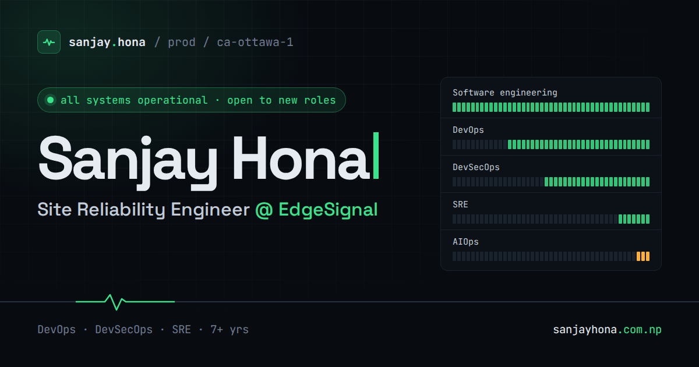

# sanjayhona.com.np

Personal site of **Sanjay Hona**, Site Reliability Engineer in Ottawa.

The site is built like an ops console: a status page, golden-signal panels, a deploy history, and a platform topology. Every number and date on it comes from real work history, not sample data.

**Live:** https://sanjayhona.com.np



## What's on the page

| Section | What it shows |
|---|---|
| Hero | Name, role, and a terminal that runs `kubectl get` / `kubectl describe` against the "currently" data |
| Golden signals | Career metrics as dashboard panels: years in production, edge fleet size, MTTR, release frequency, env setup time, audit findings |
| Service status | Each discipline tracked like a service, one cell per quarter since 2016 |
| Deploy history | Roles, newest first. The current role is `running`, past roles `exit 0` |
| Platform stack | Delivery → runtime → cloud, with security and observability as cross-cutting layers |
| About | Short README plus operating principles |
| Contact | Escalation policy: email first, LinkedIn second |

Press `/` or `⌘K` (`Ctrl K` on Windows/Linux) anywhere to open the command palette.

## Stack

- [Astro](https://astro.build) 7, static output, no client framework
- Plain CSS with design tokens; dark theme by default, light theme on toggle
- Self-hosted fonts via [Fontsource](https://fontsource.org): Space Grotesk, IBM Plex Sans, JetBrains Mono
- About 4 KB of client JavaScript: theme toggle, local clock, command palette
- Hosted on GitHub Pages behind Cloudflare, deployed by GitHub Actions
- No cookies. The site loads nothing from third parties itself; Cloudflare adds its Web Analytics beacon and Rocket Loader at the edge

## Edit the content

All copy and data live in two files. Components read from them, so most edits need no component changes.

| File | Controls |
|---|---|
| [`src/data/site.ts`](src/data/site.ts) | Name, contact, nav, signal panels, status rows, stack topology, principles, "currently" block |
| [`src/data/experience.ts`](src/data/experience.ts) | Roles, blurbs, impact chips, tags |

Hero and About prose live in [`src/components/Hero.astro`](src/components/Hero.astro) and [`src/components/About.astro`](src/components/About.astro).

## Run it locally

Requires Node 22 (same as CI).

```bash
npm ci
npm run dev       # http://localhost:4321
npm run build     # static output in dist/
npm run preview   # serve dist/
```

## Project layout

```text
src/
  components/   one file per section, plus TopBar, CommandPalette, SectionHead
  data/         site.ts and experience.ts (all content)
  layouts/      Base.astro: meta tags, JSON-LD, theme bootstrap
  pages/        index.astro and 404.astro
  scripts/      console.ts: theme, clock, nav highlight, palette, copy
  styles/       global.css: design tokens and shared primitives
public/         favicon, OG image, CNAME, robots.txt, web manifest
```

## Blog

The blog at [blog.sanjayhona.com.np](https://blog.sanjayhona.com.np) is a second Astro project in [`blog/`](blog/). It reuses the site's layout, top bar, command palette, styles, and CSP from `src/`, so both stay in one design.

Write a post by adding a Markdown file to [`blog/src/content/posts/`](blog/src/content/posts/). The filename becomes the URL:

```markdown
---
title: "Post title"
description: "One or two sentences for the index, search, and social cards."
date: 2026-09-22
tags: [sre, kubernetes]
draft: true   # shows in dev only; remove to publish
---
```

```bash
npm run dev:blog      # http://localhost:4321
npm run build:blog    # static output in blog/dist/
```

**Scheduling:** give a post a future `date` and it stays hidden (index, page, RSS, sitemap) until that day. The blog workflow runs daily at 11:00 UTC (7:00 in Ottawa) and deploys only when a post is dated today, so you can queue a week of posts at once. Use a full timestamp such as `2026-10-01T13:00:00Z` for a specific time; it goes live on the first build after it. `npm run dev:blog` shows drafts and scheduled posts with a label. GitHub pauses scheduled workflows after 60 days with no repo activity; re-enable it under Actions if that happens.

It generates an RSS feed (`/rss.xml`), a sitemap, tag pages, and a table of contents per post. Response headers such as `X-Frame-Options` live in [`blog/public/_headers`](blog/public/_headers).

## Deploy

Every push to `main` runs [`.github/workflows/static.yml`](.github/workflows/static.yml), which builds the site and publishes `dist/` to GitHub Pages. The custom domain is set in the repo's Pages settings; [`public/CNAME`](public/CNAME) mirrors it. Cloudflare proxies the domain in front of Pages.

A few values are set at build time and refresh on each deploy: the commit hash in the footer, the status page's "updated" date and quarter cells, and the terminal's `AGE` column.

The blog deploys from [`.github/workflows/blog.yml`](.github/workflows/blog.yml) to Cloudflare Pages when `blog/` or the shared `src/` files change. It needs two repo secrets, `CLOUDFLARE_API_TOKEN` (scoped to Pages edit) and `CLOUDFLARE_ACCOUNT_ID`. Without them it builds and skips the deploy.

To roll back, revert the commit on `main`. The next deploy publishes the previous version.

## Dependencies and security

- **Dependencies:** Dependabot security updates open PRs right away. Version updates come monthly, grouped: one PR for npm minor/patch bumps, one for GitHub Actions ([`.github/dependabot.yml`](.github/dependabot.yml)). Run `npm audit` for the current state.
- **CI:** every action is pinned to a full commit SHA. `npm ci --ignore-scripts` means no dependency install scripts run. The build job's token is read-only, and only the deploy job can write to Pages.
- **Content-Security-Policy:** set as a `<meta>` tag from [`astro.config.mjs`](astro.config.mjs). Astro hashes the bundled scripts; [`Base.astro`](src/layouts/Base.astro) computes the hash of its inline theme script at build time, so editing that script can't leave a stale hash. Headers a `<meta>` tag can't carry (`frame-ancestors`, `X-Frame-Options`, `Permissions-Policy`, `Referrer-Policy`) come from a Cloudflare Response Header Transform Rule, defined in [`infra/cloudflare/security-headers.mjs`](infra/cloudflare/security-headers.mjs) and applied by [`.github/workflows/edge-headers.yml`](.github/workflows/edge-headers.yml). It uses `CLOUDFLARE_ZONE_TOKEN` if set, else `CLOUDFLARE_API_TOKEN`; the token needs Zone Read, Transform Rules Edit, and Zone Settings Edit on the zone. [`infra/cloudflare/hsts.mjs`](infra/cloudflare/hsts.mjs) keeps HSTS at 1 year with includeSubDomains and preload, the minimum for the browser preload list.
- **Surface:** plain static files. No backend, no forms, no secrets in the build.

## Contact

devops@sanjayhona.com.np · [LinkedIn](https://linkedin.com/in/sanjayhona)
